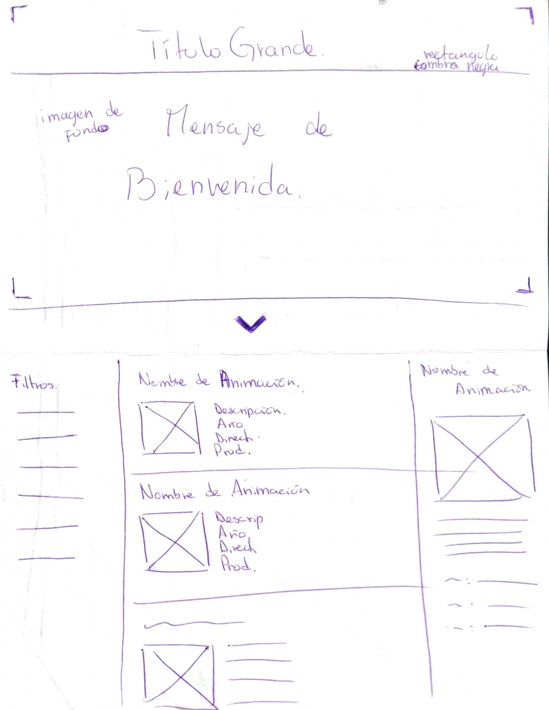
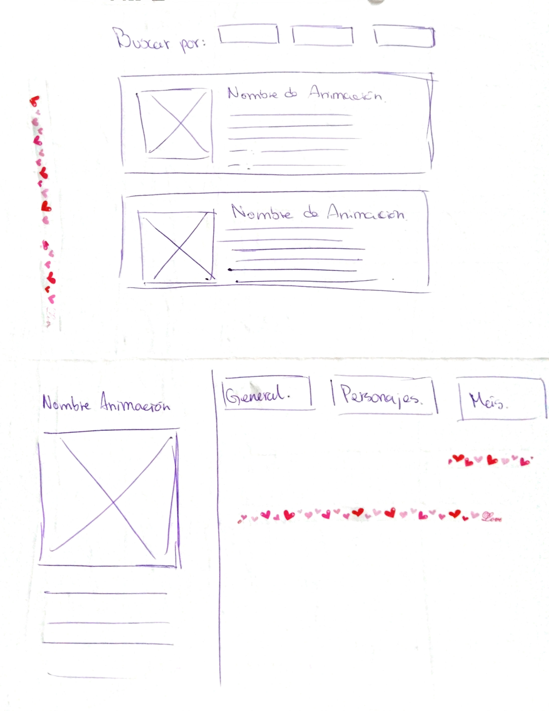
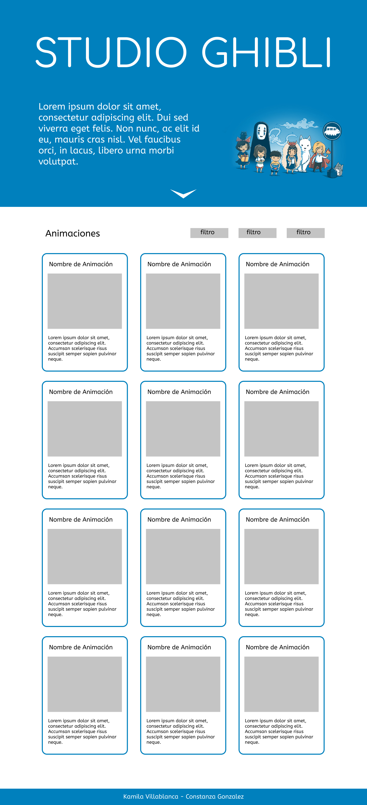
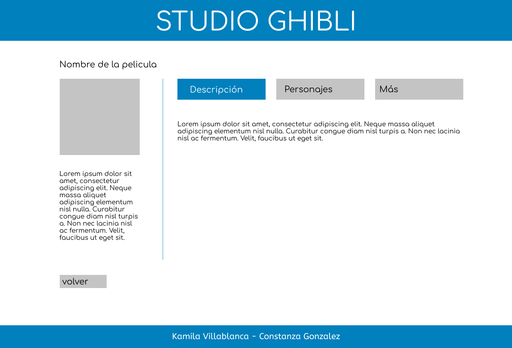
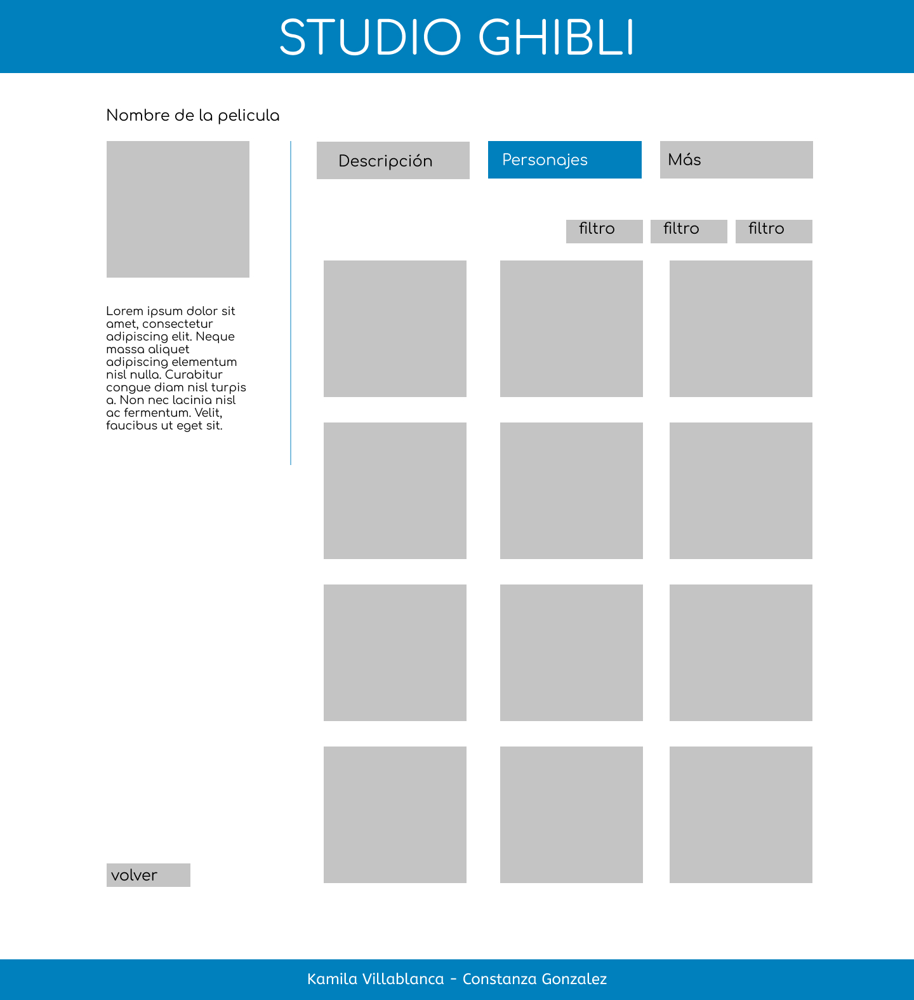
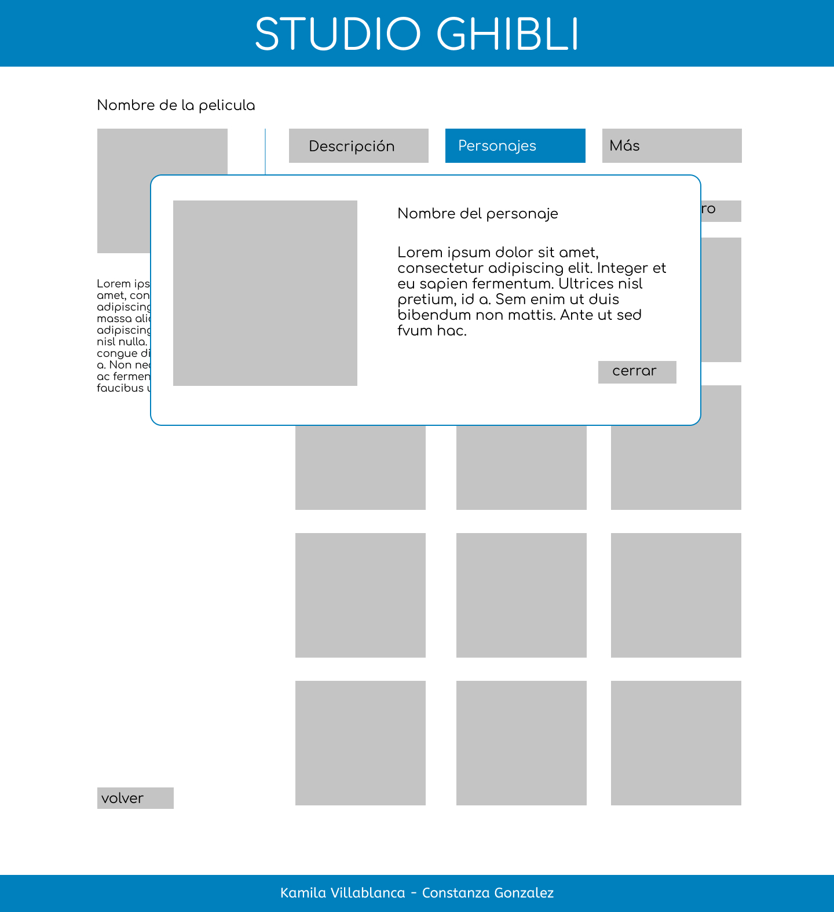
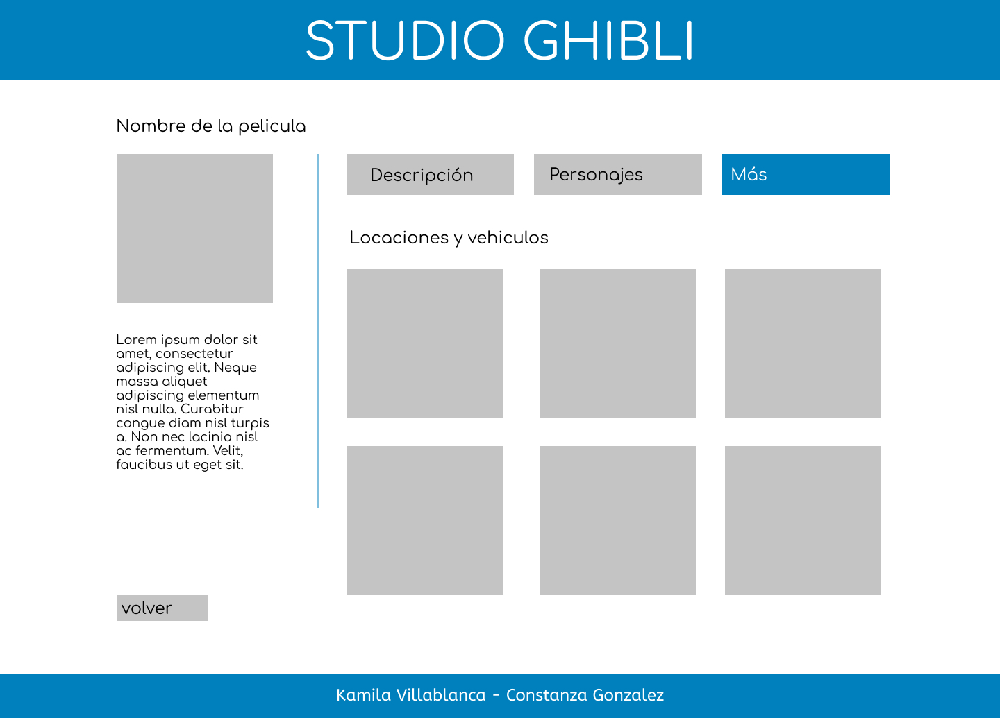
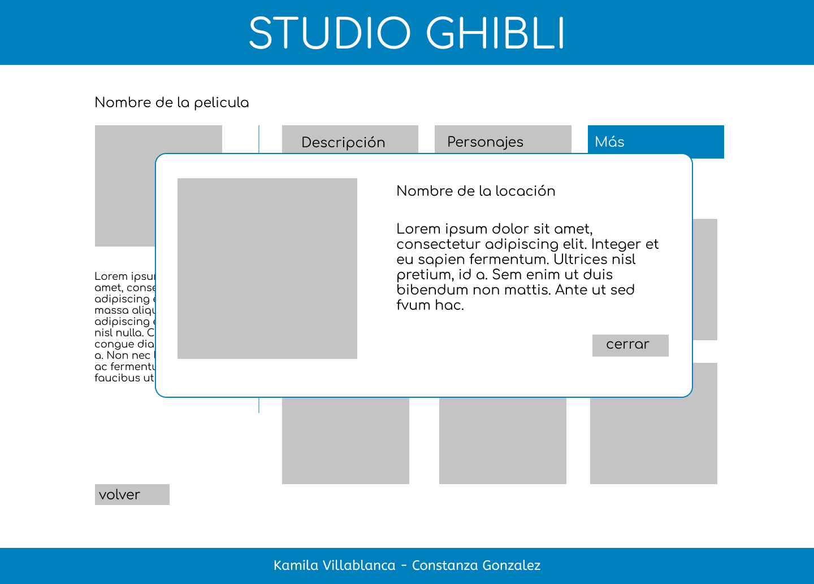

# Data-lovers - Fanpage Studio Ghibli

Link proyecto: [Ir al sitio](https://kuveee.github.io/SCL019-data-lovers/src/index.html) ó https:
Link a Zeplin: (?)
   

## 1. Definición del proyecto

Nuestro sitio web es una fanpage con temática de Studio Ghibli para sus fans, en la cual pueden ver las caratulas de las peliculas animadas, su información como descripción, director, año de lanzamiento, personajes, locaciones y más, de cada una de estas. El objetivo es hacer un sitio donde el usuario se sienta cómodo al navegarla, que su interfaz sea amigable pero a la vez dinámica y cautivadora.

### Imagen final del sitio.

## 2. Investigación UX:
### 2.1 ¿Quiénes son los principales usuarios de producto?
Son personas con un alto o pequeño interes en la animación japonesa, que puede haber visto sólo una pelicula que lo hechizó y así quiere seguir viendo todas las otras peliculas de este estudio, o solo quiere saber de qué tratan las animaciones junto a su contenido como los personajes. Un rango etario de este público objetivo seria mayoritariamente desde los 15 años a 40 años, ya que Ghibli tiene bastantes años encantando a la gente.

### 2.2 ¿Cuáles son los objetivos de estos usuarios en relación con el producto?
Conocer y saber más sobre sus fanatismos y así completar parte de sus intereses personales; ya que en la vida siempre nos gustará algo más que otra cosa, y para sentirnos felices querremos investigar todo en detalle de ese juego, artista, pelicula, serie, etc., para estar complacidos.

### 2.3 ¿Cuáles son los datos más relevantes que quieren ver en la interfaz y por qué?
Se espera visualizar todas las películas realizadas por el estudio y la información detallada de cada una, porque quisiera saber sobre su año de lanzamiento, quien la realizo, sus personajes, vehículos y mucho más.

### 2.4 ¿Cuándo utilizan o utilizarían el producto?
Mayormente se utilizaría en tiempos libres, de ocio y procrastinación, pero también existe una sección que la ocuparía para hacer trabajos o presentaciones que contengan esta temática y necesiten de esta información.

## 3. Diseño UI
### Prototipo de baja fidelidad.

### Prototipo de alta fidelidad.
https://www.figma.com/proto/mX3iAYNfEhZmFD4gl8lXrR/Data-Lovers-Studio-Ghibli?node-id=5%3A3&scaling=min-zoom&page-id=0%3A1&starting-point-node-id=5%3A3

### Historias de Usuario / Testeo de Usabilidad

## 4. Herramientas de elaboración del proyecto

HTML, CSS, javaScript.
