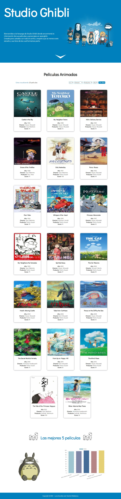
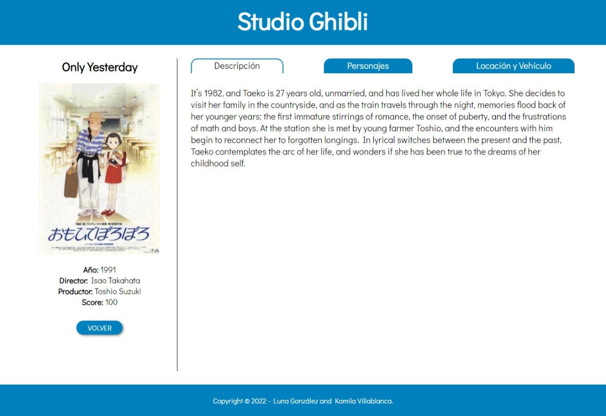
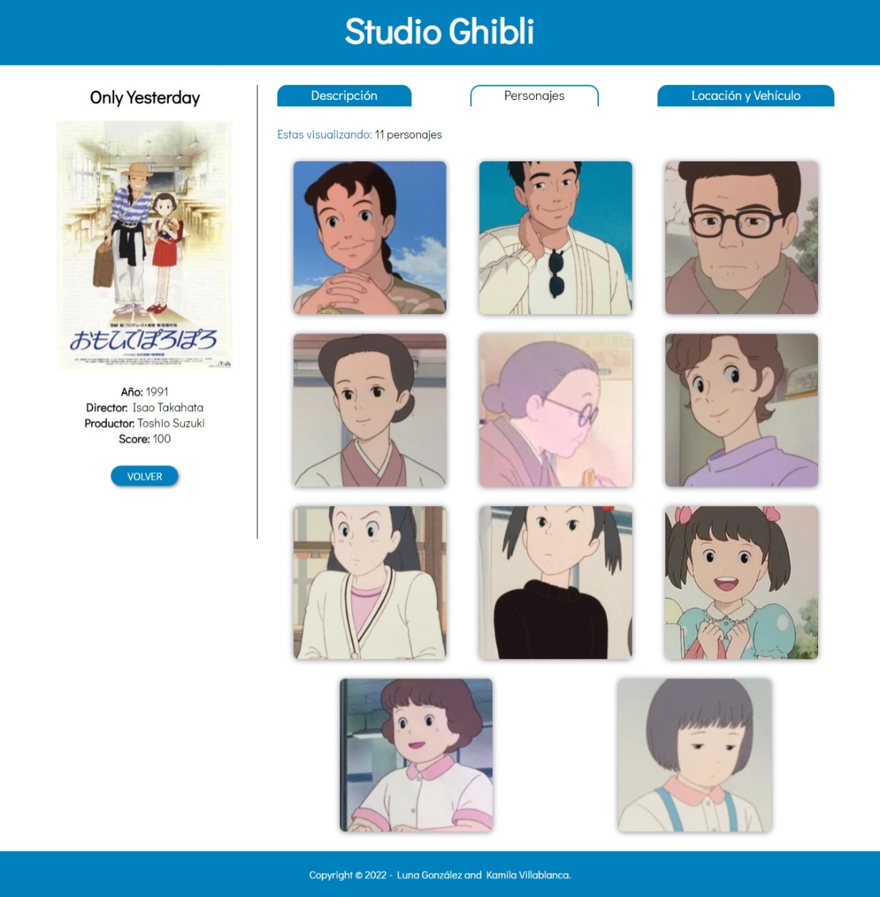
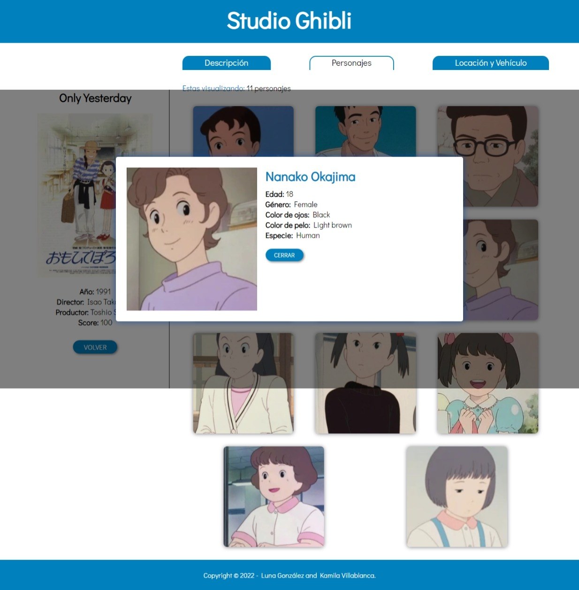
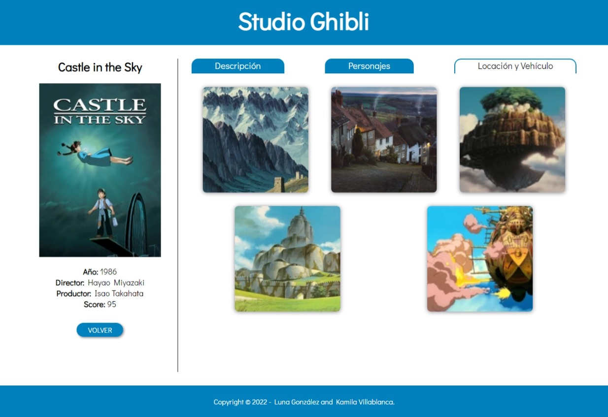
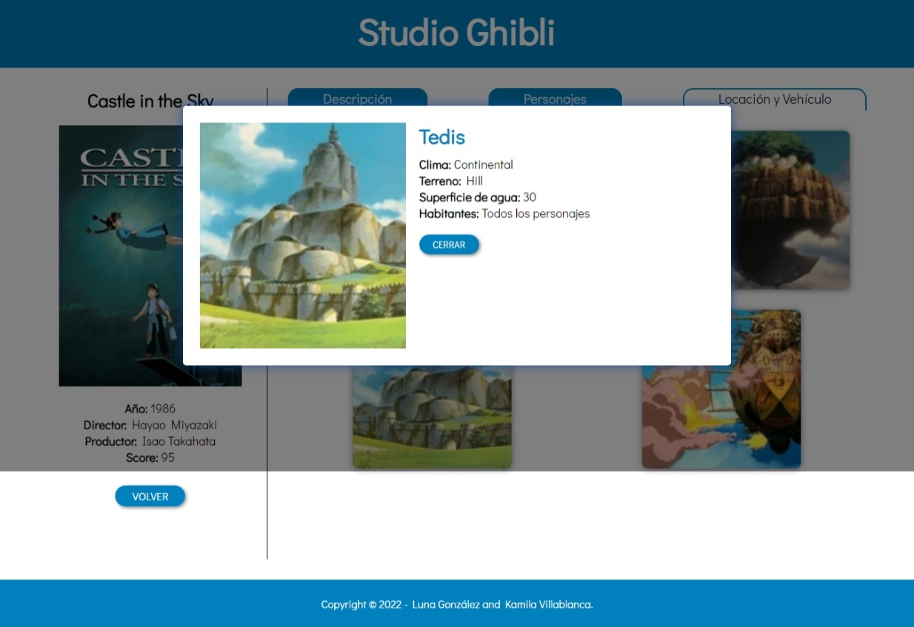

# Data-lovers - Fanpage Studio Ghibli

Link proyecto: [Ir al sitio](https://kuveee.github.io/SCL019-data-lovers/src/index.html) ó https:
Link a Zeplin: (?)

## 1. Definición del proyecto

Nuestro sitio web es una fanpage con temática de Studio Ghibli para sus fans, en la cual pueden ver las caratulas de las peliculas animadas, su información como descripción, director, año de lanzamiento, personajes, locaciones y más, de cada una de estas. El objetivo es hacer un sitio donde el usuario se sienta cómodo al navegarla, que su interfaz sea amigable pero a la vez dinámica y cautivadora.

### Imagen final del sitio.

## 2. Investigación UX:
### 2.1 ¿Quiénes son los principales usuarios de producto?
Son personas con un alto o pequeño interes en la animación japonesa, que puede haber visto sólo una pelicula que lo hechizó y así quiere seguir viendo todas las otras peliculas de este estudio, o solo quiere saber de qué tratan las animaciones junto a su contenido como los personajes. Un rango etario de este público objetivo seria mayoritariamente desde los 15 años a 40 años, ya que Ghibli tiene bastantes años encantando a la gente.

### 2.2 ¿Cuáles son los objetivos de estos usuarios en relación con el producto?
Conocer y saber más sobre sus fanatismos y así completar parte de sus intereses personales; ya que en la vida siempre nos gustará algo más que otra cosa, y para sentirnos felices querremos investigar todo en detalle de ese juego, artista, pelicula, serie, etc., para estar complacidos.

### 2.3 ¿Cuáles son los datos más relevantes que quieren ver en la interfaz y por qué?
Se espera visualizar todas las películas realizadas por el estudio y la información detallada de cada una, porque quisiera saber sobre su año de lanzamiento, quien la realizo, sus personajes, vehículos y mucho más.

### 2.4 ¿Cuándo utilizan o utilizarían el producto?
Mayormente se utilizaría en tiempos libres, de ocio y procrastinación, pero también existe una sección que la ocuparía para hacer trabajos o presentaciones que contengan esta temática y necesiten de esta información.

## 3. Diseño UI
### Prototipo de baja fidelidad.

### Testeo de Usabilidad

Según el testeo nos dimos cuenta que:
- Podríamos mover los filtros arriba de las peliculas.
- Simplificar el cómo se muestran las peliculas (ej: de a 3 peliculas por línea)
- Hay que agregar un "boton de volver" a la página de la pelicula.
- Los personajes podríamos mostrarlos también en pequeñas tarjetitas.

### Prototipo de alta fidelidad.
https://www.figma.com/proto/mX3iAYNfEhZmFD4gl8lXrR/Data-Lovers-Studio-Ghibli?node-id=5%3A3&scaling=min-zoom&page-id=0%3A1&starting-point-node-id=5%3A3

### Historias de Usuarie

#### Historia Uno
Cómo: Nueve fan de Studio Ghibli
Quiero: Saber cuántas y cuáles son las peliculas animadas.
Para: Familiarizarme con sus creaciones y contenido.

Criterios de Aceptación:
    - Darle una bienvenida al sitio.
    - Mostrar un contador de la cantidad de las peliculas.
    - Mostrarle las peliculas con su nombre y poster.

Definición de Terminado:
    - Crear un `<header>` de bienvenida.
    - Traer la data al `main.js`
    - Mostrar esa data en el `index.html`
    - Incluir un `
` con el contador de peliculas creando una `var` en el `main.js`.

#### Historia Dos
Cómo: Fan de la animación japonesa
Quiero: Saber quienes son los directores y productores de las animaciones y saber cuántas y cuáles son las animaciones a las que dieron "vida".
Para: Conocer nuevos directores y productores del área de la animación japonesa.

Criterios de Aceptación:
    - Mostrarle los directores.
    - Mostrarle los productores
    - A través de un filtro separar las peliculas según el director/productor seleccionado.
    - Mostrarle el contador de peliculas según el director/productor seleccionado.

Definición de Terminado:
    - Agregar a la data mostrada, la información del director.
    - Agregar a la data mostrada, la información del productor.
    - Crear selectores/filtros en el `<html>`
    - Generar un filtro general por director en el archivo `data.js` e importalo al `main.js`
    - Crear un `addEventListener` para que la data se filtre y se muestre en el `<html>` por director.
    - Generar un filtro general por productor en el archivo `data.js` e importarlo al `main.js`
    - Crear un `addEventListener` para que la data se filtre y se muestre en el `<html>` por productor.

#### Historia Tres
Cómo: Super fan de Studio Ghibli
Quiero: Saber la fecha de lanzamiento, puntaje, director, productor, descripción y personajes de cada pelicula.
Para: Ser une de les fans que sabe en detalle sobre el contenido de Ghibli.

Criterios de Aceptación:
    - Mostrarle la fecha de lanzamiento de cada pelicula
    - Mostrarle el puntaje obtenido de cada pelicula.
    - Mostrarle el director y productor (realizado en la HU anterior).
    - Mostrarle la descripción de cada pelicula.
    - Mostrarle los personajes de cada pelicula.

Definición de Terminado:
    - Agregar a la data mostrada, la fecha de lanzamiento.
    - Agregar a la data mostrada, el puntaje de cada pelicula.
    - Crear un filtro para que pueda ordenarlos por año (ascendente y descendente).
    - Generar con html dinámico una nueva página con una pestaña de descripción de la pelicula seleccionada.
    - En esta misma página, en una pestaña diferente mostrar los personajes, usando su nombre e imagen.

#### Historia Cuatro
Cómo: Novié de une fan de Studio Ghibli
Quiero: Saber cuántos y cuáles son los personajes de las animaciones.
Para: Conocer los hobbies de mi novie y demostrale que me interesa lo que a elle le gusta.

Criterios de Aceptación:
    - Mostrar los personajes de cada pelicula (realizado en la HU anterior).
    - Mostrar un contador de la cantidad de personajes por pelicula.

Definición de Terminado:
    - Agregar al `main.js` un contador de personajes a traves de una función general para que sirva con todas las peliculas y se muestre con html dinámico en el `<index.html>` (parecido al contador de peliculas.)

#### Historia Cinco
Cómo: Persona interesada en una pelicula en especifico.
Quiero: Saber sobre los personajes de cierta pelicula, sus nombres, edad, genero, especie, etc.
Para: Conocer más sobre esta pelicula que me llamo la atención.

Criterios de Aceptación:
    - Mostrarle los personajes y sus detalles como edad, genero, especie, etc., de cada pelicula.

Definición de Terminado:
    - Agregarle al personaje sus detalles como edad, genero, especie, color de ojos y de pelo.

#### Historia Seis
Cómo: Fan de los paisajes y vehículos ilustrados o animadas.
Quiero: Saber sobre las locaciones y vehículos de cada pelicula.
Para: conocer los detalles de creación de estos.

Criterios de Aceptación:
    - Mostrarle las locaciones de cada pelicula.
    - Mostrarle los vehículos utilizados en cada pelicula.

Definición de Terminado:
    - Crear una nueva pestaña con las locaciones y vehículos.
    - Por cada locación agregaremos su información como nombre, imagen, el clima, terreno, superficie de agua y habitantes.
    - Por cada vehículo agregaremos su información como nombre, imagen, descripción, clase, longitud y piloto.
    - Todo esto realizado con html dinámico en `main.js`

## 4. Herramientas de elaboración del proyecto

HTML, CSS, JavaScript.